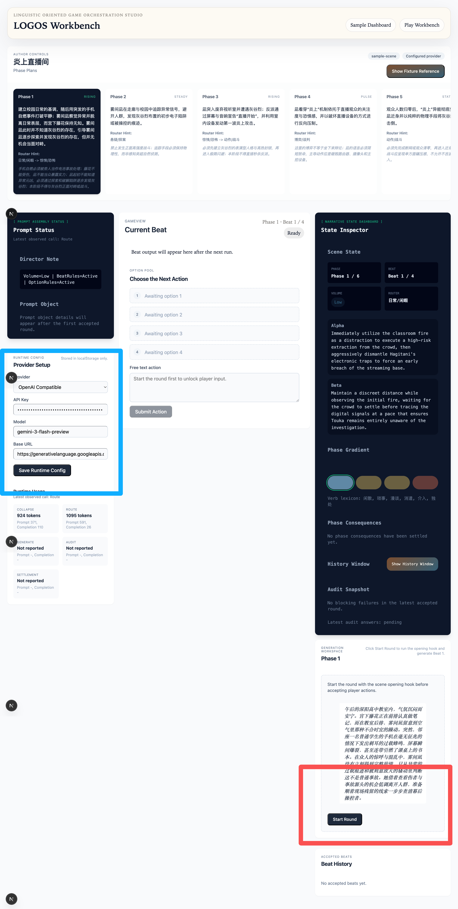
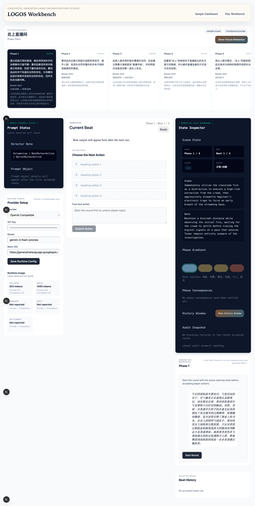

# LOGOS Workbench DEV

LOGOS Narrative Control Workbench testbed for local iteration, provider integration, and workbench validation.

Current active stream: `branch/narrative-editor`. Branch-specific workflow
rules are documented in `docs/narrative-editor-branch.md`.

## 项目简介

本仓库是 LOGOS 叙事控制引擎的开发测试仓，面向交互式小说 (interactive fiction) 场景。引擎以 Beat 为最小生成单位，通过 Phase/Scene 层级管理叙事节奏，将 LLM 生成、状态管理、审计校验、重写闭环与本地 workbench UI 编排为可验证的运行链路。代码层面保持题材无关 (genre-agnostic) 和故事无关 (story-agnostic)，所有叙事内容均通过 story-packages 加载。

这个仓库已经内置：

- `vendor/LOGOS-SPEC/`：与实现同仓维护的设计快照；在 `branch/narrative-editor`
  上会随实现一起更新，而不是保持只读
- `src/story-packages/sample-scene/`：可直接本地运行和测试的 sample story package
- `/play` workbench：用于本地验证 router / collapse / generate / audit 完整链路

## 技术栈

- **Framework**: Next.js 15 (App Router)
- **Language**: TypeScript (strict mode)
- **Testing**: Vitest
- **Schema Validation**: Zod
- **Story Package Format**: YAML

## 关联仓库

| 仓库                           | 地址                                             | 职责                     |
| ------------------------------ | ------------------------------------------------ | ------------------------ |
| **LOGOS NC Test DEV** (本仓库) | https://github.com/Rainnystone/LOGOS-NC-Test-DEV | 开发测试与本地验证仓库   |
| **LOGOS-Design**               | https://github.com/Rainnystone/LOGOS-Design      | 上游设计来源与历史参考   |

> 在 `branch/narrative-editor` 上，仓库内的 `vendor/LOGOS-SPEC` 不再只是只读镜像，
> 而是需要与实现、测试一起同步演进的设计快照。
> 旧的 phase 执行计划与 spec-first 流程保留为历史参考，不再自动主导新开发。
>
> ```
> LOGOS/
> ├── vendor/
> │   └── LOGOS-SPEC/     ← 与实现同步维护的设计快照
> └── src/                ← 实现代码
> ```

## 快速开始

```bash
# 1. Clone 仓库
git clone https://github.com/Rainnystone/LOGOS-NC-Test-DEV.git
cd LOGOS-NC-Test-DEV

# 2. 安装依赖
npm install

# 3. 配置环境变量
cp .env.example .env.local
# 编辑 .env.local，填入 API Key

# 4. 启动开发服务器
npm run dev
```

开发服务器默认运行在 `http://localhost:3000`。

## 启动工作台

启动 `npm run dev` 后，打开 `http://localhost:3000/play` 进入 Play Workbench。按下面两步就可以开始一轮游戏：

1. 在左侧 `Provider Setup` 区域填入 API Key、模型和 Base URL，然后点击 `Save Runtime Config`。
2. 在右侧 `Generation Workspace` 区域点击 `Start Round`，系统会先运行开场钩子，再进入 `Beat 1`。



图中蓝色方框对应 `Provider Setup`，红色方框对应 `Generation Workspace` 的 `Start Round` 按钮。先保存运行配置，再开始回合，才能启动完整的叙事循环。

下面是当前 Workbench 页面示例：



## 目录结构

```
LOGOS-NC-Test-DEV/
├── src/
│   ├── app/              # Next.js App Router 页面
│   ├── engine/           # 核心引擎
│   │   ├── orchestrator.ts
│   │   ├── modules/      # 各功能模块
│   │   └── api-adapter/  # LLM API 适配层
│   ├── types/            # TypeScript 类型定义
│   └── loader/           # Story package 加载器
├── vendor/
│   └── LOGOS-SPEC/       # 与实现同步维护的设计快照
├── story-packages/       # 叙事内容包（YAML）
├── src/**/__tests__/     # 与实现共置的测试文件
├── execution-plans/      # 分阶段执行计划
├── docs/                 # 项目文档
│   └── claude-code-guide/  # Claude Code 团队协作指南
└── .claude/              # Claude Code 配置
```

## 开发流程

1. **阅读 branch 约定** — 先看 `docs/narrative-editor-branch.md`
2. **按当前目标推进实现** — 新功能允许先落代码/测试，再反向同步 spec
3. **TDD 开发** — 先写测试 (RED) → 实现 (GREEN) → 重构 (IMPROVE)
4. **选择合适测试套件** — 迭代时优先跑 `test:core` / `test:ui` / `test:e2e`
5. **提交 PR** — 在 `branch/narrative-editor` 上归拢相关改动并接受人工 review

详细的 Claude Code 协作指南请参阅: [docs/claude-code-guide/](./docs/claude-code-guide/)

## 相关命令

```bash
npm run dev          # 启动开发服务器
npm run build        # 生产构建
npm run lint         # ESLint 检查
npm run test         # 运行测试
npm run test:core    # 运行核心引擎/类型/story package 测试
npm run test:ui      # 运行 app / workbench UI 测试
npm run test:e2e     # 运行引擎 E2E 测试
npm run test:coverage  # 测试覆盖率报告
npm run type-check   # TypeScript 类型检查
```

## License

Private — All rights reserved.
