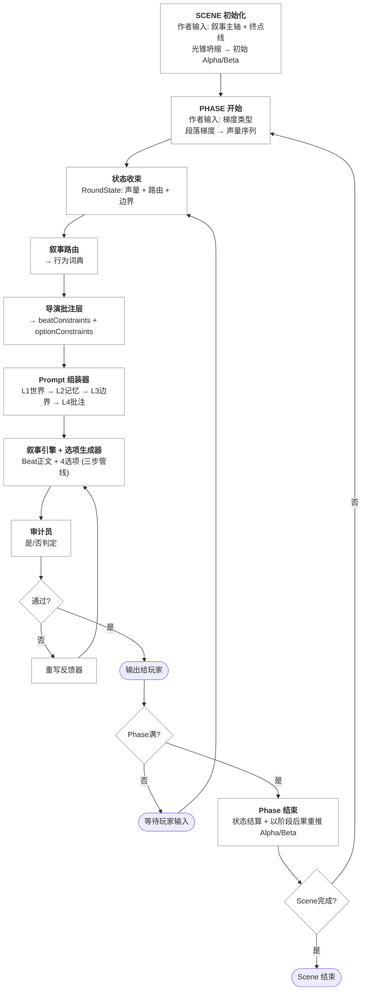

# Runtime Loop

> 若正式实施中发现 producer / consumer 链路缺口、重写链路不闭合或运行顺序与契约冲突，回看 `00_META/agent-guide.md` 附录中的 Blocker Protocol / Conflict Resolution 后再继续推进。

## 目的

这份文档只回答一个问题：在 LOGOS 的 Sample 版本中，一轮生成到底是如何推进的。它不是模块说明，因此不会细讲每个模块内部怎样实现；它也不是状态模型，因此不会重新定义状态字段。它关心的是运行时顺序、阶段切分和本轮何时被视为“完成”。

之所以需要单独写这一层，是因为 LOGOS 的价值并不来自某个单独模块，而来自多个模块按照严格顺序协作。如果没有一份独立的编排文档，后续实现很容易把 Prompt 组装、审计、重写、Phase 切换写成彼此分裂的流程。

## 全局流程总览

下图是 LOGOS Sample 版本从 Scene 初始化到 Scene 结束的完整控制流。它对应母文档中的两张 Mermaid 图的简化合并版本，目的是让 coding agent 在 10 秒内建立系统心智模型。

## 一轮的最小定义

在当前 Sample 中，一轮通常对应一个 Beat 的生成循环。它从“玩家输入已经到达”开始，到“本轮内容被接受并写入历史窗口”结束。中间可能包含审计失败后的重写，但只要系统仍在处理同一个 Beat，这些动作都属于同一轮，而不是新的一轮。

因此，一轮的完成条件不是“模型返回了正文”，而是“当前 Beat 的正文与选项已经通过审计，或者在达到重试上限后被强制放行，并且已经进入下一次可读取的历史窗口”。

## Runtime Loop 总览

当前 Sample 的标准运行顺序如下：

1. 接收玩家输入，并定位当前 Scene、Phase 与 Beat 位置。
2. 从当前 Phase 的梯度映射中取出本轮 `Beat Volume`。
3. 收束本轮控制状态，形成 `RoundState`。
4. 根据当前场景判定选择 `Narrative Router`，得到当前可用 `Verb Lexicon`。
5. 基于 `RoundState` 生成本轮 `Director Note`。
6. 由 Prompt 组装器把世界基础、历史窗口、叙事边界和导演批注拼成 `PromptObject`。
7. 调用生成链路，产出本轮 `BeatArtifact` 与 `OptionSet`。
8. 将本轮产物与审计问题打包为 `AuditPacket`，交给审计员。
9. 如果审计通过，则本轮产物写入历史窗口并输出给玩家。
10. 如果审计失败，则生成 `RewriteFeedback`，并把 `retryCount + RewriteFeedback + previousDraft` 组装成 `PromptObject.generationControl` 后在重试上限内重新走本轮生成。
11. 本轮完成后更新 Beat 计数，判断是否进入 Phase 结束处理；若当前 Phase 已满，则先做阶段后果结算，得到 `phaseConsequences[]`，再驱动 `Light Cone Collapse` 重新推演下一阶段边界。

## 详细步骤

### 1. 玩家输入进入系统

每一轮都由玩家输入触发。这个输入既可以是四个显式选项之一，也可以是自由文本；但无论来源如何，编排层都只把它视为“驱动下一轮的统一触发事件”。在这一步，系统不讨论输入是否合理，也不立即做语义裁决，而是先把它作为当前轮的因果起点写入运行时状态。

### 2. 收束本轮控制状态

在正式生成前，系统必须先把本轮真正相关的控制条件压缩出来。这一步的核心不是算得更复杂，而是防止模型在长上下文中丢失局部约束。当前轮至少需要明确：本轮属于哪个 Scene、哪个 Phase、当前 Beat 在该 Phase 中的位置、对应的 `Beat Volume`、当前 `Phase Goal`、当前 `Alpha/Beta` 边界，以及允许读取的 `HistoryWindow`。

如果这些信息没有先被收束，后续任何模块都只能自己去长文本里重新寻找它们，这会直接破坏系统的一致性。

### 3. 路由、批注与 Prompt 组装

在当前轮状态确定之后，系统为本轮选择 `Narrative Router`，并取得本轮允许使用的 `Verb Lexicon`。随后，导演批注层把当前轮最关键的控制条件重新压缩成局部高优先级文本。直到这一步完成，Prompt 组装器才开始工作，因为它的职责不是补充缺失控制，而是把已经准备好的控制条件按顺序装配起来。

在当前 Sample 中，Prompt 组装器是唯一对外出口。也就是说，叙事引擎不能跳过它直接读取某个局部模块输出，否则编排层就会失去统一装配点。

### 4. 生成与审计

生成阶段先产出本轮正文与选项，然后立即进入审计阶段。这里有一个关键约束：选项虽然在逻辑上可以被视为正文后的第二步生成，但在编排上它们仍然属于同一轮产物，因此审计永远面向“正文 + 选项”这个完整组合，而不是只检查正文。

审计的职责不是给出长评语，而是对预先选定的问题返回是/否结果。编排层接收的并不是文学评价，而是一组用于下一步流程判断的布尔条件。

### 5. 重写循环

如果审计结果中出现阻塞失败项，系统不会直接进入下一轮，而是进入重写循环。重写循环的输入是当前轮已有产物、失败项与精确的 `RewriteFeedback`；在对外契约上，这些信息会被 Orchestrator 收束为 `PromptObject.generationControl`，其中至少包括 `retryCount`、`rewriteFeedback` 与上一版失败草稿。这里的 `rewriteFeedback` 不是笼统提示，而应显式带上失败的 audit question 文本以及该问题的正确答案，使下一轮生成能够直接对照修复。重写的目标不是重新讲一个新故事，而是在尽可能保留既有内容的前提下修复当前失败条件。

当前 Sample 版本规定重写次数上限为 3 次。只要仍然在重试同一个 Beat，它就仍然属于同一轮；只有当当前 Beat 被接受或被强制放行并写入历史之后，系统才算真正离开本轮。

### 6. 本轮收尾

本轮结束时，系统要做三件事。第一，把当前被接受的正文与选项写入可供下一轮读取的历史窗口。第二，推进当前 Phase 内的 Beat 计数。第三，判断当前 Phase 是否已经完成。如果还没有完成，系统转入等待玩家下一次输入的状态；如果已经完成，则交给 Phase 生命周期处理下一层收尾动作，而这层收尾动作必须包含“从当前 Phase 已接受转录组装 `PhaseConsequencePacket` -> 结算得到 `phaseConsequences` -> 写入 `StateSnapshot` -> 基于终点线重新推演新的 `Alpha/Beta`”这一条链。

## Loop Invariants

当前版本在编排层先固定四条不变式。第一，任何一轮都必须先收束状态，再做生成，不能由模型先写再回填控制。第二，任何一轮都必须经过审计或强制放行，不能绕过检查直接进入历史。第三，重写只修本轮，不向前回滚已接受历史。第四，Prompt 组装器始终是生成链路的唯一外发口。

这些不变式的作用，是给后续实现提供一条不会轻易漂移的“流程骨架”。后续模块可以替换实现，但不应改写这些编排前提。

## Sample 版本的简化规则

当前 Sample 版本在运行循环上采用以下简化约束：

- 只存在一个活跃 Scene。
- 每个 Phase 固定按 4 Beat 推进。
- 历史窗口默认直接读取最近 5 个 Beat，不使用 Header。
- 审计只返回是/否结果，不承担复杂评语。
- 重写上限固定为 3 次。
- Phase 结束后的光锥坍缩仍遵循原始设计，必须基于上一 Phase 的真实后果重新推演下一阶段边界；Sample 的简化只体现在场景规模与状态规模，不体现在取消这条机制本身。

这些规则的目的不是永久冻结系统，而是把当前验证目标收紧到“叙事控制中心能否在线性 Sample 中稳定闭环”。
