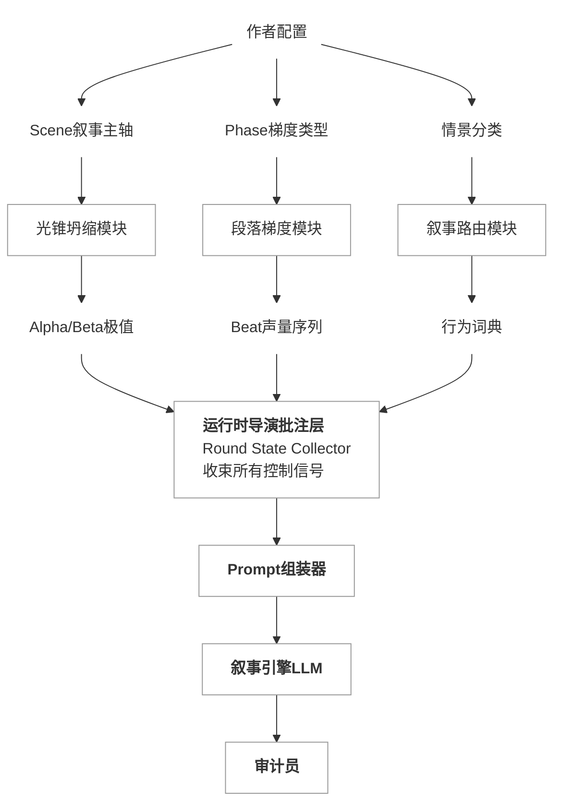
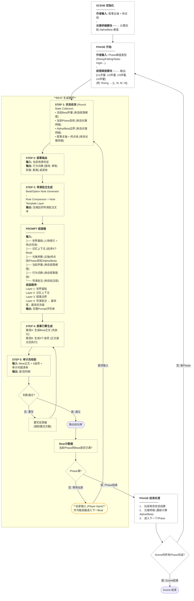
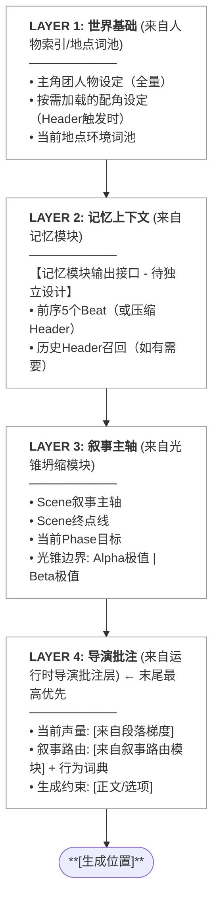

# 设计目标-MUST READ: FOR LLM
- LOGOS：Linguistic Oriented Game Orchestration Studio 
- 叙事/故事本身必须和本系统彻底解耦，本系统必须能通用在大部分题材，涵盖悬疑、动作、科幻、青春校园等，严格禁止为了任何特定剧本/故事设计本系统
- 本系统原型最终的设计目标是一个能适配多种不同LLM的API，允许作者在系统的图形界面中配置自己的故事prompt，叙事基调、声调。
- 本系统原型是一个类似为文字冒险游戏创作设计的RPG Maker
- LOGOS 被设计用来创作、编辑文字冒险/文字角色扮演游戏，其游戏模式是以 beat 为玩家最小体验节（2000-4000 字）+4 个选项+一个自由输入的文本框，非常传统的文字冒险游戏的交互方式。
- Beat 是玩家最小体验节，也是叙事引擎生成内容的最小节；Phase 是作者控制叙事节奏的最小节
- 每一轮中：Beat 和选项是一起生成

# 本项目核心目的-MUST READ: FOR LLM
- 本项目旨在快速利用 [[Draft-角色]] 和[[world_style 1]]，既不吉波普项目第一个scene 作为案例，快速测试叙事控制中心的整个设计的效果
- 在这个测试中，我们只会有一个 scene，由 4-6 个 phase 组成，不超过 30 个 beats，因此我们大幅简化了记忆的处理方式、 API 适配器的设计和部分组件的设计。
---
# API适配器 (API Adapter)
[[LOGOS Lite API适配器设计方案]]

---
# 叙事控制中心(Orchestrator Control Hub)

## 叙事单位与最小控制单位：Beat & Phase
- **Beat (节)**：最小生成单位，即玩家选择后生成的一段小说文本。即是一个Beat
- **Phase (段/段落)**：中间层，包含 **3 - 4 个 Beats**（暂定）。Phase在故事/剧情中没有任何作用，是作为叙事控制的最小单位存在。作者不可能亲自设定每个Beat的叙事细节，但一口气设置一个scene又过于宏观。作者需要简要定义每个phase的目标。
	- 示例：[[Psycho-Pass 悖论之眼  Prompt-上头蛙版本#阶段1]] 分成四个phase: 开局商超抓捕佐伯失败-探索14区-发现邪教和0犯罪系数-抓捕佐伯
- **Scene(场)**：一个独立的故事

## 叙事控制中心结构图
### 叙事控制中心完整数据流向

> **💡 图解说明：**
> 这张图展示了 LOGOS 系统如何将“作者的创作意图”一步步精准转化为“AI 能够理解和执行的指令”。整个控制流分为三个核心阶段：
> 
> 1. **作者意图解析（上层）：** 
>    系统不再让作者直接手写复杂的 Prompt，而是让作者只负责“掌舵”（设定 Scene 故事主轴、Phase 节奏快慢、情景分类）。这些宏观设定会分别被三个计算模块（光锥坍缩、段落梯度、叙事路由）动态解析为极其具体的控制参数（如玩家选项的 Alpha/Beta 边界极值、每个 Beat 的叙事声量大小、当前可用的行为词典）。
> 2. **导演要求收束（中层）：** 
>    上述所有动态生成的控制参数，都会统一汇聚到“运行时导演批注层”。它的作用就像一位真正的游戏导演，在每一轮（Beat）生成前，把所有的场面要求、节奏限制收集齐。
> 3. **组装与生成把关（下层）：** 
>    导演整理好的状态参数随后进入“Prompt 组装器”，被拼装成一份结构严密的指令发送给大模型（叙事引擎 LLM）。最终，LLM 生成的文本（正文和选项）还会经过“审计员”的最后一次把关检验，确保不偏离最初的设定。

### 完整流程

## 基础控制方式
### 节声量（Beat Volume)
我们将叙事强度解构为 时间感知、感官密度 和决策颗粒度 三个维度，这三个维度的尺度都是作为通用提示词给大模型。抽象指令应该是用户可以独自配置。叙事声量作为Prompt的一部分用来定义每个beat的叙事强度。

| 档位           | 简介         | 抽象指令定义 (The Director's Note)                                                             | 叙事效果 (Behavioral Outcome)                                           |
| :----------- | :--------- | :--------------------------------------------------------------------------------------- | :------------------------------------------------------------------ |
| **低 (Low)**  | **综述模式 **  | **时间加速流转**。侧重结果、环境大局、因果总结。禁止进行冗长的单次动作描写，鼓励使用叙述性蒙太奇。                                      | **场景平稳/转场**。角色在一段较长时间内的常态表现。虽然细节少，但文字应具有“史诗感”或“文学性”的宏观美。            |
| **中 (Med)**  | **实时模式**   | **时间匀速同步**。侧重标准对话、即时反应、空间移动。AI 应保持连贯的因果链条，模拟人类正常的实时感知速度。                                 | **标准交互/推进**。故事的骨架。对话流畅，动作清晰。这是逻辑推进最稳健的档位，也是最常用的默认状态。                |
| **高 (High)** | **慢镜头模式 ** | **时间拉伸**。**“叙事慢镜头”**。强制切入感官碎片的细颗粒度扫描（心跳、眼神/表情/微表情、微颤、材质、动作/小动作、心理活动侧写）。一轮选择仅对应物理世界较短的时间。 | **高潮/冲突/转折**。极度放大的情感压力或物理张力。AI 必须挖掘当前瞬间的“ subtext (潜台词) ”或极微小的环境反馈。 |

### 段落梯度（Phase Gradient)
一个 Phase 包含 **4 个 Beats**。导演可以为每个 Phase 指派一种梯度，Orchestrator 会根据此形成映射到对应Beat中，并且会影响选项生成

|梯度类型|乐理/几何对应|逻辑映射 (4 Beats 声量分配)|通用叙事体感 (Director's Intent)|
|:--|:--|:--|:--|
|**攀升 (Rising)**|**Crescendo**|`L -> M -> M -> H`|**张力累积**：从宏观布局逐步收窄焦点，最终锁定在微观冲突。|
|**回落 (Falling)**|**Diminuendo**|`H -> M -> M -> L`|**情感余韵**：从高压瞬间逐步拉远镜头，转向总结与平复。|
|**高压 (Static High)**|**Tenuto**|`H -> H -> H -> H`|**密集采样**：全段保持“子弹时间”，极致放大每一个感官细节和瞬时决策。|
|**凹型 (U-Shape)**|**The Lull**|`H -> L -> L -> H`|**暴雨间隙**：在高潮突发后迅速切入一段时空跳跃的冷处理，随后再次引爆新的危机。|
|**凸型 (Arch)**|**Incident**|`L -> H -> H -> L`|**局部遭遇**：一段平静的行进中突发的小型冲突或情感爆发，解决后重归平静。|
|**脉冲 (Pulse)**|**Staccato**|`H -> L -> H -> L`|**节奏切割**：快节奏的闪回或碎片化叙事，在极致特写与宏观跨度间剧烈切换。|
|**平铺 (Steady)**|**Legato**|`M -> M -> M -> M`|**标准推进**：稳健的叙事流，保持匀速的时空步进和逻辑连贯性。|

### 叙事路由 (Narrative Router) ：按文学/情景分类
为了确保生成的 4 个选项既符合当前情境，并且4个选项的生成需要有足够的区分，我们在选项生成器前加入**“叙事路由”。叙事路由的本质，是划定当前场景的“行为词典 (Verb Lexicon)”。在这个特定的路由下，叙事引擎只能从这个词典中抽取动作概念来生成选项或以近义词作为参考生成选项。

路由可以有非常多，导演甚至可以自定义扩充。以下是一些核心的基础路由情景分类：

*   **[动作/战斗 (Action & Combat)]**
    *   **核心语义**：暴力、生存、对抗、战术。
    *   **正交参考词表 (参考发散用)**：
        *   强攻 (Assault)：直接施加破坏性力量（如：射击、挥砍、冲撞）。
        *   牵制 (Suppress)：限制敌方行动或视野（如：火力压制、抛掷障碍、释放烟幕）。
        *   防御 (Defend)：承受或化解到来的伤害（如：格挡、举盾、硬抗）。
        *   机动 (Maneuver)：改变自身在空间中的位置（如：翻滚、攀爬、冲刺、滑铲）。
        *   脱离 (Disengage)：放弃当前对抗区域（如：撤退、逃跑、寻找掩体）。
        *   器物 (Utilize)：借助外部非武器环境（如：打爆管道、触发机关、利用地形陷阱）。
*   **[悬疑/探案 (Mystery & Investigation)]**
    *   **核心语义**：信息搜集、推理、发现、剖析。
    *   **正交参考词表 (参考发散用)**：
        *   勘查 (Inspect)：对物理环境进行静息扫描（如：翻找、放大查看、化验、搜身）。
        *   质证 (Interrogate)：对有意识的目标施加压力以获取信息（如：逼问、对峙、拆穿谎言）。
        *   诱导 (Elicit)：通过非强迫手段使目标暴露信息（如：套话、伪装身份、旁敲侧击）。
        *   演绎 (Deduce)：对已有信息进行内部重组（如：联想、比对档案、推理拼凑）。
        *   潜伏 (Stealth)：在不改变环境状态下获取动态信息（如：窃听、尾随、暗中观察）。
        *   干预 (Tamper)：主动改变系统状态以观察反应（如：骇入终端、触发警报测试安保）。
*   **[浪漫/亲密 (Romance & Intimacy)]**
    *   **核心语义**：情感拉扯、身体接触、心理防御的放下或建立。
    *   **正交参考词表 (参考发散用)**：
        *   表露 (Confess)：直接、清晰地传达正面情感（如：表白、赞美、直视双眼）。
        *   触碰 (Contact)：打破物理边界的正面接触（如：牵手、拥抱、亲吻、抚摸）。
        *   调情 (Flirt)：带有模糊性和试探性的言语/神态（如：开暧昧玩笑、耳语、挑逗）。
        *   退缩 (Withdraw)：因羞涩或防御机制而拉大距离（如：移开视线、脸红低头、结巴）。
        *   掩饰 (Deflect)：用相反的情绪掩盖真实波动（如：傲娇反驳、故意岔开话题、假装生气）。
        *   共鸣 (Resonate)：在非言语层面与对方保持同频（如：相视一笑、并肩沉默、倾听）。
*   **[博弈/谈判 (Political & Negotiation)]**
    *   **核心语义**：利益交换、心理战、威逼利诱。
    *   **正交参考词表 (参考发散用)**：
        *   施压 (Coerce)：利用自身优势强迫对方（如：威胁、下最后通牒、展示武力/证据）。
        *   利诱 (Incentivize)：提供正向收益换取妥协（如：开出条件、利益交换、许诺未来）。
        *   虚张 (Bluff)：利用信息差伪造己方优势（如：假装离席、虚报底牌、故作镇定）。
        *   示弱 (Concede)：主动让渡部分利益以换取更大空间（如：妥协、请求宽恕、交出控制权）。
        *   拆解 (Deconstruct)：攻击对方立论或立场的薄弱点（如：指出逻辑漏洞、挑拨离间）。
        *   搁置 (Stall)：拒绝在当前条件下达成协议（如：转移焦点、要求暂停、引入第三方）。
*   **[惊悚/恐怖 (Horror & Survival)]**
    *   **核心语义**：无力感、隐藏、极度恐惧。
    *   **正交参考词表 (参考发散用)**：
        *   静息 (Freeze)：试图将自身存在感降至最低（如：屏住呼吸、僵在原地、闭上眼睛）。
        *   隐匿 (Hide)：寻找物理遮蔽物（如：钻进柜子、躲入阴影、匍匐前进）。
        *   窥探 (Peek)：在极度恐惧中试图获取威胁信息（如：回头看、从缝隙张望、侧耳倾听）。
        *   应激 (Flee)：不受控制地爆发求生本能（如：尖叫逃跑、盲目狂奔、胡乱挣扎）。
        *   绝境 (Desperate)：在无路可退时的最后挣扎（如：抓起钝器乱挥、推倒重物阻挡、祈祷）。
        *   强识 (Anchor)：试图用理性对抗恐惧（如：深呼吸强迫冷静、心理暗示“这不是真的”）。
*   **[日常/闲暇 (Slice of Life)]**
    *   **核心语义**：放松、羁绊培养、生活琐事。
    *   **正交参考词表 (参考发散用)**：
        *   闲散 (Idle)：无明确目的的消耗时间（如：发呆、看风景、打瞌睡）。
        *   琐事 (Routine)：执行生活中的既定程序（如：做饭、打扫、整理装备）。
        *   漫谈 (Chat)：无负担的轻度社交（如：聊八卦、吐槽天气、谈论爱好）。
        *   消遣 (Recreate)：主动寻求轻度娱乐（如：玩游戏、看书、听音乐）。
        *   介入 (Meddle)：对周围发生的无害小事产生兴趣（如：凑热闹、顺手帮忙、插一句嘴）。
        *   独处 (Isolate)：主动在社交环境中划定私人结界（如：戴上耳机、独自走到角落）。

---
## 叙事控制方案 A：光锥坍缩

本方案是一种基于叙事空间状态迭代的叙事控制，先由作者定义故事的正常主线作为轴线再由叙事引擎基于轴线生成最激进和最消极的两个叙事边界，叙事模型根据玩家行为决策定期结算然后收束叙事边界
### 1. 结构定义：Scene 级光锥 
剧本不再是写死的树状图或预生成的矩阵，而是围绕一条叙事/故事轴线对称展开的**动态可能性空间**。整个 Scene 只存在一个由窄到宽的光锥。
*   **叙事主轴**：
    *   作者为 Scene 设定的线性故事轴线（例如：Scene起点 $\rightarrow$ 途经点 A $\rightarrow$ 途经点 B $\rightarrow$Scene 终点），这里定义了故事的发展方向
*   **Scene终点线 ：
    *   这个Scene轴线终点（即改Scene故事/叙事的结尾，由作者定义）所在的终点线，与Scene轴线垂直。这是一条线而不是一个点的原因是，作者一般定义的是主角在这个时候的某一个状态的阶段性情况，比如在情感故事中可能是男女主角的关系阶段性进展（比如接吻），但是其他状态，诸如和其他角色的关系、主角的心理身体健康状态等，在作者定义的轴线终点并不一定被详细定义（也不建议详细定义，否则故事就失去了涌现的空间）。
*   **因果弹性法则 (Causal Elasticity) —— 初始边界推导**：
    *   在 Scene 开始时，叙事引擎基于这条叙事轴线，自主推导出在Scene终点线必须达到的情况下，玩家最极端的行为作为光锥的边界。
    *   **左侧极值 (Alpha / 激进极)**：叙事在达成目标的前提下，所能允许的最激进、破坏性或冲突性最强的剧情偏离极限。
    *   **右侧极值 (Beta / 消极极)**：叙事在达成目标的前提下，所能允许的最消极、拖沓、被动或迂回的剧情偏离极限。
    *   **通用解耦**：无论题材是探案（暴力执法 vs 畏缩不前）还是恋爱（极致强攻 vs 极度傲娇躲避），该极值模型均绝对适用。

### 2. 运行机制：段落内即时演算与段落末坍缩 
*   **段落内的即时演算：
    *   在一个段落的周期内（例如 Beat 1 -> Beat 3），光锥边界保持恒定。
    *   选项在边界内按选项生成控制生成或玩家自由输入，大模型在此容差空间内进行即时演算，顺应玩家行为产生剧情涌现，**不进行任何未来分支的预生成**。
*   **段落末尾的强制坍缩与重铸 ：
    *   当到达本段落预设的末尾（如 Beat 4），系统执行**状态强制结算**。
    *   **玩家角色状态结算点**：叙事系统提取玩家在过去一个 Phase 中累积的行为后果，如：玩家角色自身心理身体健康状态、环境变化、时间流失、NPC信任度改变、人际/势力关系等。
    *   **光锥坍缩**：叙事引擎以这个**玩家角色状态结算点**为新坐标，重新看向本Scene终点线，基于玩家角色此时的状态，重新推演下一阶段的 Alpha 和 Beta 极值，Alpha和Beta的新极值必须小于上一个极值，即坍缩。
    *   **基于玩家选择的因果收束**：由于玩家在故事中做出了选择，从而对周围环境和叙事产生了影响，因此玩家需要对自己的选择负责，整个坍缩机制也是一种对玩家行为的反馈机制，在努力保证叙事仍然往作者设定方向的前提下。

### 3. 选项生成器
按照读取上文-叙事路由-段落梯度定义下一轮声量-生成光锥内，目标终点线的 4 个选项
首先，叙事引擎必须回顾前述5个节（暂定5个，未来将由记忆模块提供上文回顾内容），然后叙事路由选择具体的行为词典并从中挑选 4 个方向直接使用或作为参考使用绝对近义词，限定本轮选项生成的情景范围。之后选项生成器必须根据段落梯度中定义的下一轮的节声量，来生成 4 个选项，这四个选项比如在叙事路由、段落梯度和光锥边界的限制下的同时，必须基于 COT 合理推理主角此时的心理活动，在叙事路由限定的范围内生成四个选项。

#### 3.1 选项生成器管线 (Option Generator Pipeline )
选项生成器是连接“玩家当前状态”与“下一个叙事节点”的核心桥梁。为了确保生成的 4 个选项既有绝对的区分度，又不会出现角色 OOC，同时还能完美契合剧情节奏，系统将通过以下**结构化管线**动态生成选项：

*   **第一步：上下文读取与路由定调 (Context & Router)**
    *   **提取记忆**：叙事引擎首先回顾前文（暂定提取前 5 个 Beat 的剧情），确立玩家当前的处境与状态残骸。
      note: 前文回顾数量和回顾方式在记忆模块想清楚后，会由记忆模块输出，而不是直接定义节数量
    *   **加载词典**：引擎判定当前所处的**叙事路由**（如：`[动作/战斗]`），并直接从该路由专属的“行为词典”中，强制抽取 4 个正交的动作方向（如：强攻、防御、牵制、脱离），或其绝对近义词。这在物理层面上限制了选项的情景范围，确保 4 个选项截然不同。

*   **第二步：基于 CoT 的心理学推导 (Anti-OOC Engine)**
    *   在生成具体文本前，引擎强制大模型在后台进行一次“思维链（Chain of Thought）”推导。
    *   **推导逻辑**：大模型必须结合【主角设定的性格】与【当前光锥的边界】，自主推演主角在面对第一步抽取的 4 个动作时，其**真实的内心活动和动机**。
    *   *(注：此机制是防止 OOC 的绝对核心。例如，同一个“强攻”动作，懦弱角色的 CoT 会推导为“闭眼乱挥”，而战神角色的 CoT 会推导为“战术突击”。若抽取的词汇超出了当前光锥的物理限制，CoT 也会自动将其合理化为“绝望/无效的尝试”。)*

*   **第三步：声量模具的最终应用 (Volume Formatting)**
    *   **动能赋予**：最后，选项生成器读取**段落梯度**中定义的“下一轮节声量（Volume）”。
    *   **文本输出**：大模型根据目标声量的颗粒度要求（如：High 的微观感官聚焦，或 Low 的宏观时空跨度），将第二步推导出的心理动机，润色并包装为最终展示给玩家的 4 个行动选项。
 ---
### 运行时导演批注层（Director's Note Layer）

运行时导演批注层是叙事控制中心在**每一轮生成**时调用的局部控制模块。它接收当前轮已经确定好的叙事控制结果，将其整理为短促、明确、强约束的导演批注，用于约束这一轮生成出来的 **Beat 正文** 与 **4 个选项**。它不负责记忆压缩，不负责上下文排序，也不负责决定剧情主线，只负责把当前轮必须被模型优先服从的控制条件重新明确化，例如当前声量、叙事路由、当前 Phase 目标以及 Alpha / Beta 光锥边界。

#### 子模块划分
*   **1. 当前轮控制状态收束器（Round State Collector）**
    *   从 Orchestrator 接收当前轮已经确定的控制结果。
    *   统一整理本轮生成 Beat 与生成选项共同需要遵守的控制信息。
    *   当前阶段最小输入包括：当前声量、当前路由、当前 Phase 局部目标、当前 Scene 方向、当前 Alpha / Beta 边界，以及少量硬规则。

*   **2. 正文导演批注生成器（Beat Note Generator）**
    *   为当前轮的 Beat 正文生成导演批注。
    *   重点约束当前正文的镜头尺度、时间流速、感官密度与因果边界。
    *   保证这一轮正文的叙事推进服从当前 Volume 与光锥限制，而不是自由散开。

*   **3. 选项导演批注生成器（Option Note Generator）**
    *   为当前轮的 4 个选项生成导演批注。
    *   重点约束选项的动作语义范围、彼此之间的正交性、角色行为是否 OOC，以及是否越出 Alpha / Beta 边界。
    *   保证 4 个选项既有区分度，又仍然属于当前轮允许的叙事可能空间。

*   **4. 规则压缩器（Rule Compressor）**
    *   将本轮控制条件压缩成短文本，而不是膨胀成第二份系统提示。
    *   只保留当前轮最容易被长上下文稀释、但又最关键的局部信号。
    *   不复述前文剧情，不承担摘要功能。

*   **5. 批注模板层（Note Template Layer）**
    *   维护导演批注的固定格式。
    *   同一轮中分别为正文与选项调用不同模板，但二者共享同一套当前轮控制状态。
    *   保证不同轮次之间批注风格稳定，便于后续测试和调参。

#### 当前阶段的边界
*   **当前版本直接读取前序 5 个 Beat**，不足 5 个时则全读。
*   **当前版本不依赖 Header**，因为 Header 仍属于记忆模块。
*   **当前版本只服务 sample**，目标是验证叙事控制是否有效。
*   **当前版本只输出本轮导演批注**，不负责最终 Prompt 的加载顺序与装配。

#### 核心定义
运行时导演批注层服务的不是整个故事，而是当前这一轮。它的职责不是补充设定，而是把当前轮生成 Beat 与生成选项时必须优先服从的控制条件重新钉回模型面前。

---
### 审计员（Auditor）

审计员是叙事控制中心在**每一轮生成结束后**调用的语义判定模块。它读取当前轮允许访问的上下文材料，对一组预先定义好的关键问题进行判断，并且只返回 **是 / 否** 结果。它不负责生成内容，不负责解释原因，也不负责决定流程推进，只负责对当前轮生成出来的 **Beat 正文** 与 **4 个选项** 进行最基础、最关键的结果判定，用于辅助代码系统决定本轮内容是否通过，是否需要重写，或是否满足某个阶段条件。

#### 子模块划分
*   **1. 审计问题清单（Audit Questions）**
    *   由作者预先定义，并由当前 Scene、当前 Phase 与当前轮控制目标共同选取一组关键是否问题。
    *   问题必须短、明确、单义，且可以被回答为“是”或“否”。
    *   问题应当保持题材无关，服务于通用叙事控制，而不是依赖某个特定故事脚本。

*   **2. 审计调用器（Audit Caller）**
    *   在每轮生成完成后，向审计员提交当前轮允许访问的上下文材料。
    *   当前阶段输入包括：前序 5 个 Beat（不足 5 个则全读）、当前轮生成的 Beat 正文、当前轮生成的 4 个选项，以及当前轮审计问题清单。
    *   审计员只返回对应问题的“是 / 否”结果，不附加额外叙事内容。

*   **3. 审计裁决器（Audit Resolver）**
    *   由代码实现。
    *   负责读取审计员返回的结果，并根据预先定义好的规则决定本轮是否通过。
    *   代码而非审计员负责决定：哪些问题属于阻塞项，哪些失败必须触发重写，哪些结果会推进阶段状态。

*   **4. 重写反馈器（Rewrite Feedback Builder）**
    *   当本轮未通过审计时，将失败项整理为精确的重写要求，返回主叙事引擎重新生成。
    *   当前阶段建议限制重写次数，避免循环重试。
    *   重写反馈应当只描述未通过的关键条件，而不替代叙事生成本身。

#### 当前阶段的边界
*   **当前版本只做关键的“是 / 否”判断**，不承担复杂评语与解释任务。
*   **当前版本不负责流程计数**，因为例如 Phase 长度等结构信息可以直接由代码控制。
*   **当前版本不负责题材理解扩展**，它服务的是通用叙事结构中的阶段条件、目标达成、选项合法性等基础判断。
*   **当前版本不负责最终裁决**，它只是判定器，最终通过与否始终由代码系统决定。

#### 核心定义
审计员服务的不是某一个具体故事，而是**当前这一轮的关键结果判定**。它的职责不是创作，也不是规划，而是以最小的语义判断成本，为代码系统提供一组可靠的“是 / 否”结果，使 LOGOS 能在不同题材下都维持基础的叙事控制稳定性。

---
[[LOGOS_Prompt组装器设计方案]]
### Prompt组装器
#### 设计前提
**Sample测试范围**：
说明：为了快速测试叙事控制中心效果，会以叙事控制中心为核心，选取一个Scene（场/Scene)作为 Sample 测试。完整版本中的 Prompt 组装器需要从记忆模块接收完整的定义好的上文信息，而 Sample 测试中则会要求全量读取。
- 1个Scene
- 4-6个Phase（每个Phase约4个Beat）
- 全量前序5个Beat（记忆模块placeholder）
**核心原则**：
- **不重新定义**，只组装已有模块输出
- **Recency Priority**：核心控制放末尾
- **接口预留**：记忆模块独立设计
#### 职责边界
- 只负责**组装**，不负责生成任何内容
- 接收各模块的输出，按顺序拼接成最终Prompt
- 遵循Recency Bias原则：核心控制放末尾

#### 输入接口

| 来源    | 字段                                                   | 说明                |
| ----- | ---------------------------------------------------- | ----------------- |
| 人物索引  | `mainCharacters`                                     | 主角团设定             |
| 人物索引  | `npcCharacters`                                      | 按需加载的配角           |
| 地点词池  | `locationPatch`                                      | 当前环境特征词           |
| 记忆模块  | `precedingBeats`                                     | 前序5个Beat（Sample版） |
| 光锥坍缩  | `mainAxis`, `endState`, `phaseGoal`, `alpha`, `beta` | 光锥参数              |
| 段落梯度  | `currentVolume`                                      | 当前Beat声量          |
| 叙事路由  | `routerName`, `verbLexicon`                          | 路由名称+行为词典         |
| 导演批注层 | `directorNote`                                       | 压缩后的批注文本          |

